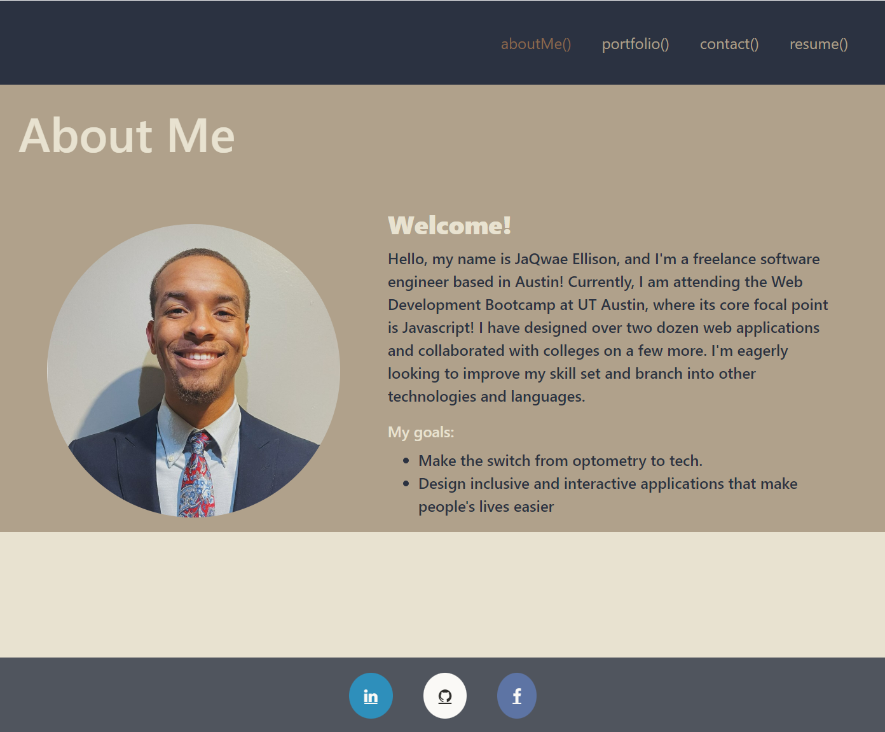

# React Portfolio

## Description
This application is my portfolio built with react.

## Table of Contents
### [Installation](#installation)
### [Usage](#usage)
### [Contributors](#contributors)
### [Licenses](#licenses)
### [Tests](#tests)
### [Questions](#questions)

## Installation
To run this application, you must complete the following steps:
  - First, download node.js and vs code.
  - Next, open the corresponding terminal for this program.
  - Then, input  ```npm i```  in the terminal.
  - Lasty, run ```npm run start``` in the terminal.
  
  If all steps above are completed correctly, then the application should generate a local copy of my portfolio.

## Usage


### Features:

#### Technologies use:
    - React.js
	
#### Future feature implementation includes:

	- Getting rid of the buttons and adding a hover animation displaying links to the repo and deployed application.
	- Cleaning up some bugs with the error messages on the contact form.
	- Making the resume and about me page less static and more interactive.


## Contributors
JaQwae Ellison

## Licenses
None

## Tests
None 

## Questions
### Contact me here:
Email: jaqwaeellison@gmail.com
